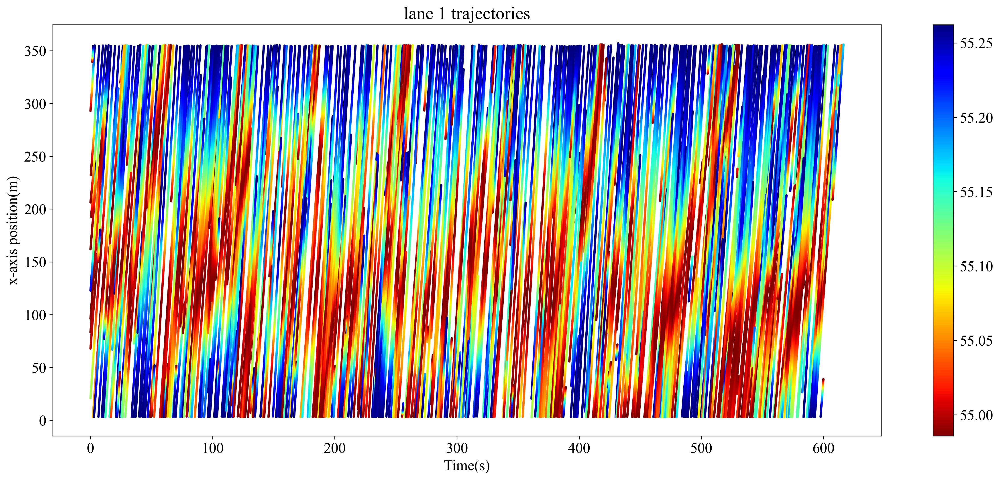
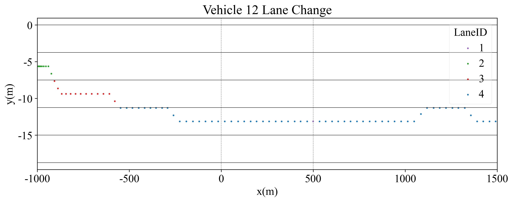

# traj_plot
plot vehicle trajetories, such as lane-change, time-space.

## time-space plot
plot (time, distance) for each lane.

## lane-change plot
plot (x,y) with lane as label, or plot(time, lane) or (distance, lane).

